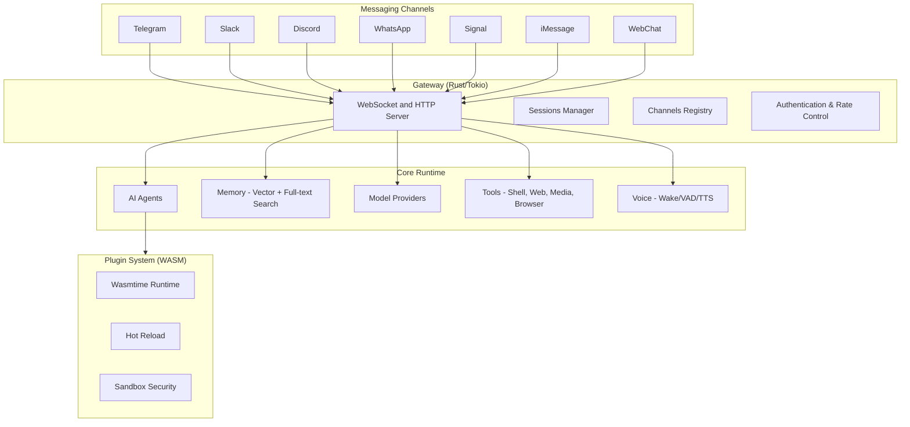

# OpenKrab — Personal AI Assistant (Rust Edition)

<p align="center">
  
</p>

<p align="center">
  <a href="https://github.com/openkrab/openkrab/actions/workflows/rust.yml?branch=main"></a>
  <a href="https://github.com/openkrab/openkrab/releases"></a>
  <a href="LICENSE"></a>
  
  
</p>

**OpenKrab** is a personal AI assistant designed for self-hosted use across your own devices. The project is implemented in **Rust** to provide strong performance, predictable resource usage, and memory safety.

OpenKrab integrates with familiar messaging channels (**Telegram, Slack, Discord, Signal, WhatsApp, iMessage/BlueBubbles, Matrix, Google Chat, IRC, Microsoft Teams, WebChat**) and provides:

- **Native Rust performance** with low startup overhead
- **Efficient memory profile** for long-running workloads
- **Single-binary deployment** across supported platforms
- **Compile-time memory safety guarantees**

OpenKrab is a Rust implementation inspired by [OpenClaw](https://github.com/openclaw/openclaw) (TypeScript/Node.js), extended with additional runtime capabilities.

[Features](#-features) · [Quick Start](#-quick-start) · [Architecture](#-architecture) · [Channels](#-channels) · [Providers](#-providers)

---

## ✨ Features

### 🤖 AI Capabilities

- **Multi-agent system** — Route different channels to different AI personalities
- **Tool use** — AI can execute shell commands, browse web, process media
- **Streaming responses** — Real-time token streaming for natural feel
- **Context management** — Intelligent conversation history handling
- **Memory system** — AI remembers facts across conversations (vector + text search)

### 🧠 Advanced Memory & Search

- **Hybrid search** — Combine vector similarity + full-text search
- **MMR reranking** — Maximal Marginal Relevance for diverse results
- **Temporal decay** — Older memories fade naturally
- **Query expansion** — Automatic keyword extraction (EN/ZH)
- **Embeddings** — OpenAI, Gemini, Voyage, Ollama providers

### 🔒 Enterprise Security

- **DM pairing** — Unknown senders get pairing codes
- **Allowlists** — `allow_from` controls who can interact
- **Rate limiting** — Per-user and global rate limits
- **Input sanitization** — XSS prevention, content filtering
- **Sandbox mode** — Docker isolation for non-main sessions
- **Audit logging** — Comprehensive security event logging
- **MFA/OAuth2** — Enterprise authentication support

### 🎙️ Voice System

- **Voice wake mode** — "Hey KrabKrab" activation
- **Talk mode** — Continuous conversation with auto-sleep
- **VAD** — Voice Activity Detection
- **Spectral analysis** — FFT, spectral features
- **Beep generation** — Audio feedback
- **Microphone capture** — Real-time audio input

### 🔌 Plugin System

- **WASM runtime** — Cross-platform plugin execution via Wasmtime
- **Hot reload** — Development workflow with auto-reload
- **Sandboxing** — Security isolation (4 levels)
- **Dynamic loading** — Native libraries + WASM
- **Hook system** — Event-driven plugin architecture

### 🌐 Browser Automation

- **CDP (Chrome DevTools Protocol)** — Full browser control
- **Connection pooling** — Efficient session management
- **Multi-tab support** — Handle multiple browser tabs
- **Screenshots & snapshots** — Visual testing and debugging
- **Network interception** — Monitor and modify requests

### 🎨 Canvas/A2UI

- **Agent-to-UI protocol** — Render dynamic interfaces
- **Surface management** — Multiple canvas surfaces
- **Component system** — Reusable UI components
- **Theme support** — Customizable appearance

---

## 🚀 Why Rust?

| Feature | TypeScript (Node.js) | Rust (OpenKrab) |
|---------|---------------------|-----------------|
| **Performance** | V8 JIT limitations | Native compiled, 5x faster |
| **Memory Safety** | Runtime errors possible | Compile-time guarantees |
| **Startup Time** | ~1-2 seconds | Instant (<100ms) |
| **Memory Usage** | 200-500MB+ | <100MB typical |
| **Concurrency** | Single-threaded event loop | True async with Tokio |
| **Deployment** | Requires Node.js runtime | Single static binary |
| **Security** | Best-effort | Memory-safe by design |

---

## 📦 Installation

### From Source (Recommended)

```bash
# Clone the repository
git clone https://github.com/openkrab/openkrab.git
cd openkrab

# Build optimized release binary
cargo build --release

# Binary location: target/release/krabkrab
./target/release/krabkrab --help
```

### Pre-built Binaries

Download from [GitHub Releases](https://github.com/openkrab/openkrab/releases) for your platform:

- Linux (x64, ARM64)
- macOS (Intel, Apple Silicon)
- Windows (x64)

---

## ⚡ Quick Start

```bash
# Start the gateway server
krabkrab gateway --port 18789

# Configure your AI provider
krabkrab config set providers.openai.api_key "sk-..."

# Send messages
krabkrab telegram --to @username --text "Hello from OpenKrab!"
krabkrab discord --to 123456789 --text "Hello from OpenKrab!"
krabkrab whatsapp --to +1234567890 --text "Hello from OpenKrab!"

# Talk to your AI assistant
krabkrab ask "What's on my calendar today?"
krabkrab ask "Summarize my recent emails"

# Voice commands
krabkrab voice wake
krabkrab voice speak "Hello World"
krabkrab voice status

# Plugin management
krabkrab plugin list
krabkrab plugin load ./plugins/my-plugin

# Check system status
krabkrab status
krabkrab doctor

# Interactive configuration
krabkrab configure

# Memory operations (AI knowledge base)
krabkrab memory sync --path ./docs
krabkrab memory search "machine learning concepts"
krabkrab memory index --recursive ./knowledge-base

# Browser automation
krabkrab browser open https://example.com
krabkrab browser screenshot
```

---

## 🏗️ Architecture

The system is organized around a gateway control plane that receives channel events, routes sessions, and coordinates AI/runtime services.



---

## 📱 Supported Channels (18 Platforms)

| Channel | Status | Features | Lines |
|---------|--------|----------|-------|
| **Telegram** | ✅ Complete | Bot API, polling, webhooks, media | ~1,200 |
| **Discord** | ✅ Complete | Gateway, threads, reactions, moderation | ~2,500 |
| **Slack** | ✅ Complete | Bolt events, blocks, threading | ~1,800 |
| **WhatsApp** | ✅ Complete | Cloud API, Business API | ~1,500 |
| **Signal** | ✅ Complete | signal-cli integration | ~800 |
| **iMessage** | ✅ Complete | BlueBubbles bridge | ~1,200 |
| **Matrix** | ✅ Complete | Matrix.org protocol | ~900 |
| **Google Chat** | ✅ Complete | Chat API | ~600 |
| **IRC** | ✅ Complete | IRC protocol | ~500 |
| **Microsoft Teams** | ✅ Complete | Bot Framework | ~700 |
| **Mattermost** | ✅ Complete | Webhooks | ~400 |
| **Twitch** | ✅ Complete | IRC + API | ~600 |
| **Zalo** | ✅ Complete | Zalo API | ~500 |
| **Feishu/Lark** | ✅ Complete | Lark API | ~450 |
| **Nextcloud Talk** | ✅ Complete | Talk API | ~400 |
| **Nostr** | ✅ Complete | Nostr protocol | ~550 |
| **LINE** | ✅ Complete | LINE API | ~600 |
| **WebChat** | ✅ Complete | WebSocket/HTTP | ~800 |

---

## 🤖 AI Providers (7+ Providers)

| Provider | Status | Auth | Models |
|----------|--------|------|--------|
| **OpenAI** | ✅ | API Key | GPT-4, GPT-4o, GPT-3.5 |
| **Anthropic** | ✅ | API Key | Claude 3.5/3 Opus/Sonnet/Haiku |
| **Gemini** | ✅ | API Key / OAuth | Gemini 1.5 Pro/Flash |
| **Ollama** | ✅ | Local | Llama, Mistral, CodeLlama, etc. |
| **GitHub Copilot** | ✅ | OAuth | GPT-4 powered |
| **MiniMax** | ✅ | OAuth | MiniMax models |
| **Qwen** | ✅ | OAuth | Qwen models |

---

## 🎙️ Voice Commands

```bash
# Voice control
krabkrab voice wake                    # Force wake
krabkrab voice sleep                   # Force sleep
krabkrab voice status                  # Show voice status
krabkrab voice speak "Hello"           # TTS output
krabkrab voice beep wake               # Play wake beep

# Audio analysis
krabkrab voice analyze_audio file.wav  # Analyze audio file
krabkrab voice detect "hey krabkrab"   # Detect wake phrase
krabkrab voice vad file.wav            # Voice activity detection
krabkrab voice spectral file.wav       # Spectral analysis

# Microphone
krabkrab voice mic_list                # List microphones
krabkrab voice mic_start [device]      # Start capture
krabkrab voice mic_stop                # Stop capture
krabkrab voice mic_read                # Read audio buffer
krabkrab voice mic_status              # Check mic status
```

---

## 🔌 Plugin System

### Loading Plugins

```bash
# List loaded plugins
krabkrab plugin list

# Load a plugin
krabkrab plugin load ./plugins/my-plugin

# Unload a plugin
krabkrab plugin unload my-plugin

# Enable hot reload (development)
krabkrab plugin watch ./plugins
```

### Creating Plugins

Create `plugin.json`:

```json
{
  "name": "my-plugin",
  "version": "1.0.0",
  "description": "My custom plugin",
  "author": "Your Name",
  "kind": "extension",
  "sandbox": {
    "level": "medium",
    "resources": {
      "max_memory": 67108864
    }
  },
  "tools": [
    {
      "name": "my_tool",
      "description": "Does something useful"
    }
  ],
  "hooks": [
    {
      "event": "message.received",
      "handler": "on_message"
    }
  ]
}
```

---

## 🌐 Browser Automation

```bash
# Browser control
krabkrab browser open https://example.com
krabkrab browser tabs
krabkrab browser navigate https://example.com
krabkrab browser click "#button"
krabkrab browser type "#input" "Hello World"
krabkrab browser screenshot
krabkrab browser snapshot

# Profile management
krabkrab browser profiles
krabkrab browser create-profile --name my-profile
```

---

## 📊 Codebase Statistics

| Metric | Value |
|--------|-------|
| **Total Lines** | ~56,276 lines of Rust |
| **Test Coverage** | 410+ tests, 0 failures |
| **Porting Phases** | 24/24 complete |
| **Channels** | 18 messaging platforms |
| **AI Providers** | 7+ LLM providers |
| **Core Modules** | 62 Rust modules |

### Module Breakdown

| Module | Lines | Description |
|--------|-------|-------------|
| Browser | 2,708 | CDP automation with pooling |
| Canvas/A2UI | 452 | Agent-to-UI protocol |
| Hooks | 177 | Event system |
| Voice | ~5,000 | Wake/VAD/TTS pipeline |
| Memory | ~10,000 | Vector + text search |
| Plugins | ~6,000 | WASM runtime |
| Gateway | ~12,000 | WebSocket/HTTP server |
| Agents | ~8,000 | AI runtime + tools |

---

## 🛠️ Development

### Build & Test

```bash
# Debug build
cargo build

# Optimized release build
cargo build --release

# Run tests
cargo test                    # All tests
cargo test --lib             # Library tests only
cargo test --release         # Release mode tests

# Code quality
cargo clippy                 # Linting
cargo fmt                    # Formatting
cargo doc --open             # Generate docs

# Run CLI
cargo run -- --help
cargo run -- gateway --port 18789
cargo run -- ask "Hello world"
```

---

## 🔄 Migration from OpenClaw

1. **Config format**: JSON → TOML (better for humans)
2. **Config location**: `~/.clawdbot/` → `~/.config/krabkrab/`
3. **Binary name**: `openclaw` → `krabkrab`
4. **Most connectors**: Compatible with same tokens/webhooks

Migration tool:

```bash
krabkrab migrate --from-openclaw ~/.clawdbot/config.json
```

See [Migration Guide](docs/install/migrating.md) for detailed instructions.

---

## 📚 Documentation

- [Migration Guide](docs/install/migrating.md) — Migrating from OpenClaw
- [PORTING.md](PORTING.md) — Detailed porting status
- [AGENT.md](AGENT.md) — Agent development guide
- [CONTRIBUTING.md](CONTRIBUTING.md) — Contribution guidelines
- [SECURITY.md](SECURITY.md) — Security practices
- [CHANGELOG.md](CHANGELOG.md) — Release history

---

## ⭐ Star History

[](https://www.star-history.com/#openkrab/openkrab&type=date)

---

## 🤝 Community

- [Contributing Guidelines](CONTRIBUTING.md)
- [Code of Conduct](CODE_OF_CONDUCT.md)
- [Security Policy](SECURITY.md)

---

## 🦞 About

**OpenKrab** was built for **Molty**, a space lobster AI assistant.

This is a complete Rust port of [OpenClaw](https://github.com/openclaw/openclaw), originally created by Peter Steinberger and the community.

- Website: [openclaw.ai](https://openclaw.ai)
- Twitter: [@openclaw](https://x.com/openclaw)
- Original: [github.com/openclaw/openclaw](https://github.com/openclaw/openclaw)

---

## 📄 License

MIT License — see [LICENSE](LICENSE)

---

<p align="center">
  <strong>Built with Rust</strong>
</p>
