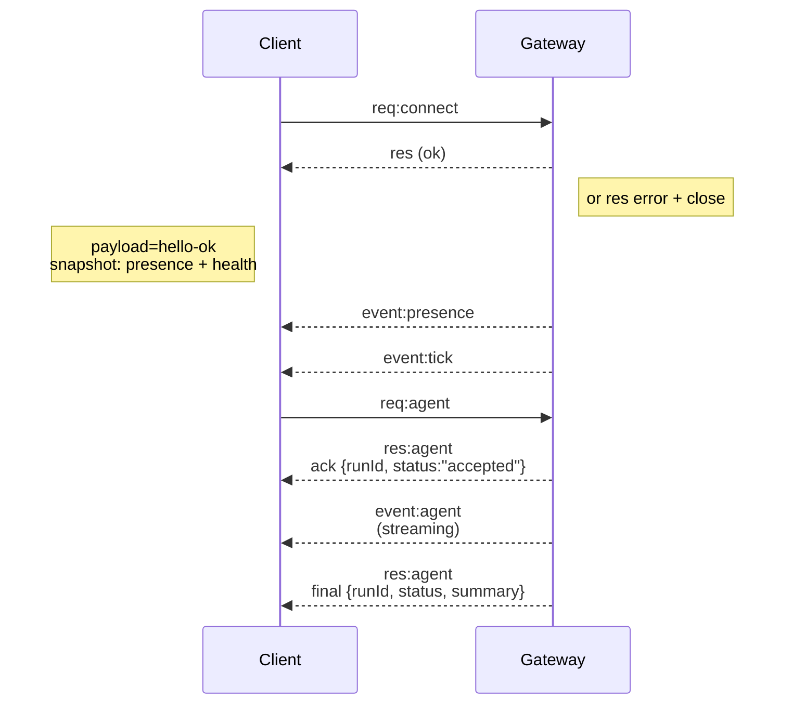
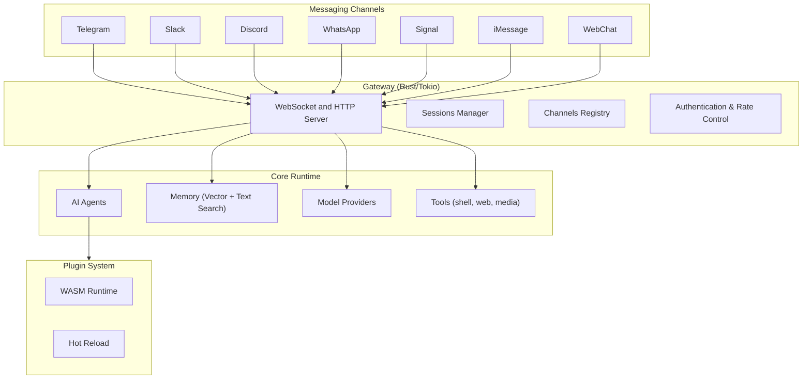

# Gateway architecture

Last updated: 2026-02-20

## Overview

- A single long‑lived **Gateway** owns all messaging surfaces (Telegram, Slack, Discord, WhatsApp, Signal, iMessage, WebChat).
- Control-plane clients (CLI, web UI, automations) connect to the
  Gateway over **WebSocket** on the configured bind host (default
  `127.0.0.1:18789`).
- **Nodes** (macOS/iOS/Android/headless) also connect over **WebSocket**, but
  declare `role: node` with explicit caps/commands.
- One Gateway per host.
- The **canvas host** is served by the Gateway HTTP server under `/canvas/`.

## Components and flows

### Gateway (daemon)

- Maintains provider connections.
- Exposes a typed WS API (requests, responses, server‑push events).
- Validates inbound frames.
- Emits events like `agent`, `chat`, `presence`, `health`.

### Clients (CLI / web admin)

- One WS connection per client.
- Send requests (`health`, `status`, `send`, `agent`).
- Subscribe to events (`tick`, `agent`, `presence`).

### Nodes (macOS / iOS / Android / headless)

- Connect to the **same WS server** with `role: node`.
- Provide a device identity in `connect`; pairing is **device‑based** (role `node`) and
  approval lives in the device pairing store.
- Expose commands like `canvas.*`, `camera.*`, `location.get`.

Protocol details:

- [Gateway protocol](/gateway/protocol)

### WebChat

- Static UI that uses the Gateway WS API for chat history and sends.
- In remote setups, connects through the same SSH/Tailscale tunnel as other
  clients.

## Connection lifecycle (single client)

## Wire protocol (summary)

- Transport: WebSocket, text frames with JSON payloads.
- First frame **must** be `connect`.
- After handshake:
  - Requests: `{type:"req", id, method, params}` → `{type:"res", id, ok, payload|error}`
  - Events: `{type:"event", event, payload, seq?, stateVersion?}`
- If `KRABKRAB_GATEWAY_TOKEN` (or `--token`) is set, `connect.params.auth.token`
  must match or the socket closes.
- Idempotency keys are required for side‑effecting methods (`send`, `agent`) to
  safely retry; the server keeps a short‑lived dedupe cache.
- Nodes must include `role: "node"` plus caps/commands/permissions in `connect`.

## Pairing + local trust

- All WS clients (operators + nodes) include a **device identity** on `connect`.
- New device IDs require pairing approval; the Gateway issues a **device token**
  for subsequent connects.
- **Local** connects (loopback or the gateway host's own tailnet address) can be
  auto‑approved to keep same‑host UX smooth.
- **Non‑local** connects must sign the `connect.challenge` nonce and require
  explicit approval.

## Architecture diagram

## Rust implementation notes

- **Tokio** async runtime for high-performance I/O
- **Axum** for HTTP/WebSocket server
- **Serde** for JSON serialization
- **Qdrant** or in-memory store for vector search
- **WASMtime** for plugin sandboxing

See [GitHub repo](https://github.com/openkrab/openkrab) for source code.
