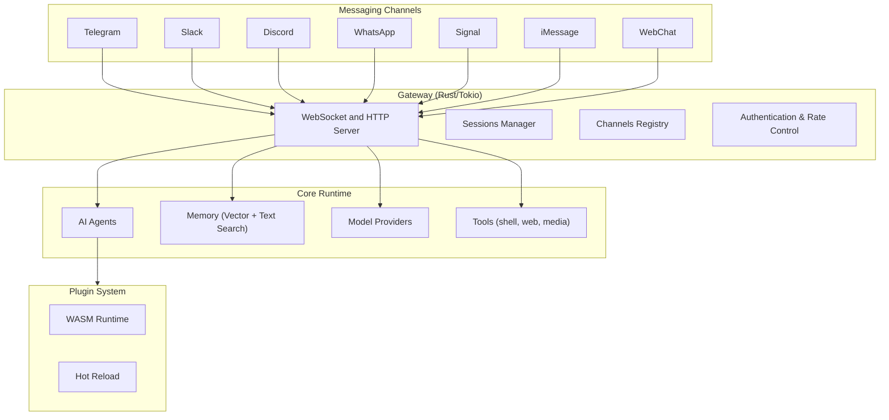

# OpenKrab 🦀 <!-- deployment-trigger-2026-02-22 -->

<p align="center">
    
</p>

> _"EXFOLIATE! EXFOLIATE!"_ — Molty, a space lobster

<p align="center">
  <strong>High-performance AI assistant in Rust with multi-channel gateway.</strong><br />
  Connect Telegram, Slack, Discord, WhatsApp, Signal, iMessage, and more to your personal AI.
</p>

<Columns>
  <Card title="Get Started" href="/start/getting-started" icon="rocket">
    Install OpenKrab and bring up the Gateway in minutes.
  </Card>
  <Card title="Configure" href="/start/configuration" icon="settings">
    Set up your AI providers and messaging channels.
  </Card>
  <Card title="Web Dashboard" href="/web/dashboard" icon="layout-dashboard">
    Launch the browser dashboard for chat, config, and sessions.
  </Card>
</Columns>

## What is OpenKrab?

OpenKrab is a **personal AI assistant** written in **Rust** that connects your favorite chat apps — Telegram, Slack, Discord, WhatsApp, Signal, iMessage, and more — to AI agents. It provides native performance, memory safety, and efficient resource usage for self-hosted deployment.

**Who is it for?** Developers and power users who want a fast, secure, personal AI assistant they can message from anywhere — without giving up control of their data or relying on hosted services.

**What makes it different?**

- **Rust-powered**: Native performance, memory safety, single binary deployment
- **Multi-channel**: One Gateway serves Telegram, Slack, Discord, WhatsApp, Signal, and more simultaneously
- **AI-native**: Built for AI agents with tool use, sessions, memory (vector + text search), and multi-agent routing
- **Voice-enabled**: Wake word detection, talk mode, VAD, and audio processing
- **Plugin system**: WASM runtime with hot reload and sandboxing
- **Open source**: MIT licensed, community-driven

**What do you need?** Rust 1.75+ (or pre-built binary), an API key (OpenAI/Anthropic/Gemini), and 5 minutes.

## How it works



The Gateway is the single source of truth for sessions, routing, and channel connections.

## Key capabilities

<Columns>
  <Card title="Multi-channel gateway" icon="network">
    Telegram, Slack, Discord, WhatsApp, Signal, iMessage with a single Gateway process.
  </Card>
  <Card title="Rust performance" icon="zap">
    Native compiled binary, <100MB memory, instant startup.
  </Card>
  <Card title="Multi-agent routing" icon="route">
    Isolated sessions per agent, workspace, or sender.
  </Card>
  <Card title="Memory system" icon="brain">
    Hybrid vector + full-text search with temporal decay.
  </Card>
  <Card title="Voice system" icon="mic">
    Wake word detection, VAD, talk mode, audio processing.
  </Card>
  <Card title="Plugin system" icon="plug">
    WASM runtime with hot reload and sandboxing.
  </Card>
</Columns>

## Quick start

<Steps>
  <Step title="Install OpenKrab">
    ```bash
    # From source
    git clone https://github.com/openkrab/openkrab.git
    cd openkrab
    cargo build --release
    ```
  </Step>
  <Step title="Configure and start the Gateway">
    ```bash
    # Set your AI provider
    krabkrab config set providers.openai.api_key "sk-..."

    # Start the gateway
    krabkrab gateway --port 18789
    ```
  </Step>
  <Step title="Send messages">
    ```bash
    krabkrab telegram --to @username --text "Hello from OpenKrab!"
    krabkrab ask "What's on my calendar today?"
    ```
  </Step>
</Steps>

Need the full install and dev setup? See [Quick start](/start/quickstart).

## Dashboard

Open the browser dashboard after the Gateway starts.

- Local default: [http://127.0.0.1:18789/](http://127.0.0.1:18789/)
- Remote access: [Web surfaces](/web) and [Tailscale](/gateway/tailscale)

## Configuration

Config lives at `~/.config/krabkrab/config.toml`.

- If you **do nothing**, OpenKrab uses default settings with OpenAI provider.
- If you want to lock it down, start with `channels.telegram.allow_from` and rate limiting.

Example:

```toml
[channels.telegram]
allow_from = ["@username"]
rate_limit = 100

[providers.openai]
api_key = "sk-..."
model = "gpt-4o"

[memory]
enabled = true
embedding_provider = "openai"
```

## Start here

<Columns>
  <Card title="Docs hubs" href="/start/hubs" icon="book-open">
    All docs and guides, organized by use case.
  </Card>
  <Card title="Configuration" href="/gateway/configuration" icon="settings">
    Core Gateway settings, tokens, and provider config.
  </Card>
  <Card title="Remote access" href="/gateway/remote" icon="globe">
    SSH and tailnet access patterns.
  </Card>
  <Card title="Channels" href="/channels/telegram" icon="message-square">
    Channel-specific setup for Telegram, Slack, Discord, and more.
  </Card>
  <Card title="Voice System" href="/tools/voice" icon="mic">
    Wake word, talk mode, VAD, and audio processing.
  </Card>
  <Card title="Help" href="/help" icon="life-buoy">
    Common fixes and troubleshooting entry point.
  </Card>
</Columns>

## Learn more

<Columns>
  <Card title="Full feature list" href="/concepts/features" icon="list">
    Complete channel, routing, memory, and voice capabilities.
  </Card>
  <Card title="Memory System" href="/concepts/memory" icon="brain">
    Hybrid search, embeddings, and knowledge base.
  </Card>
  <Card title="Multi-agent routing" href="/concepts/multi-agent" icon="route">
    Workspace isolation and per-agent sessions.
  </Card>
  <Card title="Security" href="/gateway/security" icon="shield">
    Tokens, allowlists, sandboxing, and safety controls.
  </Card>
  <Card title="Plugin System" href="/tools/plugin" icon="puzzle">
    WASM runtime, hot reload, and sandboxing.
  </Card>
  <Card title="About and credits" href="/reference/credits" icon="info">
    Project origins, contributors, and license.
  </Card>
</Columns>
