---
read_when:
  - 新規ユーザーにkrabkrabを紹介するとき
summary: krabkrabは、あらゆるOSで動作するAIエージェント向けのマルチチャネルgatewayです。
title: KrabKrab
x-i18n:
  generated_at: "2026-02-08T17:15:47Z"
  model: claude-opus-4-5
  provider: pi
  source_hash: fc8babf7885ef91d526795051376d928599c4cf8aff75400138a0d7d9fa3b75f
  source_path: index.md
  workflow: 15
---

# KrabKrab 🦞

<p align="center">
    
    
</p>

> _「EXFOLIATE! EXFOLIATE!」_ — たぶん宇宙ロブスター

<p align="center">
  <strong>WhatsApp、Telegram、Discord、iMessageなどに対応した、あらゆるOS向けのAIエージェントgateway。</strong><br />
  メッセージを送信すれば、ポケットからエージェントの応答を受け取れます。プラグインでMattermostなどを追加できます。
</p>

<Columns>
  <Card title="はじめに" href="/start/getting-started" icon="rocket">
    krabkrabをインストールし、数分でGatewayを起動できます。
  </Card>
  <Card title="ウィザードを実行" href="/start/wizard" icon="sparkles">
    `krabkrab onboard`とペアリングフローによるガイド付きセットアップ。
  </Card>
  <Card title="Control UIを開く" href="/web/control-ui" icon="layout-dashboard">
    チャット、設定、セッション用のブラウザダッシュボードを起動します。
  </Card>
</Columns>

krabkrabは、単一のGatewayプロセスを通じてチャットアプリをPiのようなコーディングエージェントに接続します。krabkrabアシスタントを駆動し、ローカルまたはリモートのセットアップをサポートします。

## 仕組み

```mermaid
flowchart LR
  A["チャットアプリ + プラグイン"] --> B["Gateway"]
  B --> C["Piエージェント"]
  B --> D["CLI"]
  B --> E["Web Control UI"]
  B --> F["macOSアプリ"]
  B --> G["iOSおよびAndroidノード"]
```



Gatewayは、セッション、ルーティング、チャネル接続の信頼できる唯一の情報源です。

## 主な機能

<Columns>
  <Card title="マルチチャネルgateway" icon="network">
    単一のGatewayプロセスでWhatsApp、Telegram、Discord、iMessageに対応。
  </Card>
  <Card title="プラグインチャネル" icon="plug">
    拡張パッケージでMattermostなどを追加。
  </Card>
  <Card title="マルチエージェントルーティング" icon="route">
    エージェント、ワークスペース、送信者ごとに分離されたセッション。
  </Card>
  <Card title="メディアサポート" icon="image">
    画像、音声、ドキュメントの送受信。
  </Card>
  <Card title="Web Control UI" icon="monitor">
    チャット、設定、セッション、ノード用のブラウザダッシュボード。
  </Card>
  <Card title="モバイルノード" icon="smartphone">
    Canvas対応のiOSおよびAndroidノードをペアリング。
  </Card>
</Columns>

## クイックスタート

<Steps>
  <Step title="krabkrabをインストール">
    ```bash
    npm install -g krabkrab@latest
    ```
  </Step>
  <Step title="オンボーディングとサービスのインストール">
    ```bash
    krabkrab onboard --install-daemon
    ```
  </Step>
  <Step title="WhatsAppをペアリングしてGatewayを起動">
    ```bash
    krabkrab channels login
    krabkrab gateway --port 18789
    ```
  </Step>
</Steps>

完全なインストールと開発セットアップが必要ですか？[クイックスタート](/start/quickstart)をご覧ください。

## ダッシュボード

Gatewayの起動後、ブラウザでControl UIを開きます。

- ローカルデフォルト: [http://127.0.0.1:18789/](http://127.0.0.1:18789/)
- リモートアクセス: [Webサーフェス](/web)および[Tailscale](/gateway/tailscale)

<p align="center">
  
</p>

## 設定（オプション）

設定は`~/.krabkrab/krabkrab.json`にあります。

- **何もしなければ**、krabkrabはバンドルされたPiバイナリをRPCモードで使用し、送信者ごとのセッションを作成します。
- 制限を設けたい場合は、`channels.whatsapp.allowFrom`と（グループの場合）メンションルールから始めてください。

例：

```json5
{
  channels: {
    whatsapp: {
      allowFrom: ["+15555550123"],
      groups: { "*": { requireMention: true } },
    },
  },
  messages: { groupChat: { mentionPatterns: ["@krabkrab"] } },
}
```

## ここから始める

<Columns>
  <Card title="ドキュメントハブ" href="/start/hubs" icon="book-open">
    ユースケース別に整理されたすべてのドキュメントとガイド。
  </Card>
  <Card title="設定" href="/gateway/configuration" icon="settings">
    Gatewayのコア設定、トークン、プロバイダー設定。
  </Card>
  <Card title="リモートアクセス" href="/gateway/remote" icon="globe">
    SSHおよびtailnetアクセスパターン。
  </Card>
  <Card title="チャネル" href="/channels/telegram" icon="message-square">
    WhatsApp、Telegram、Discordなどのチャネル固有のセットアップ。
  </Card>
  <Card title="ノード" href="/nodes" icon="smartphone">
    ペアリングとCanvas対応のiOSおよびAndroidノード。
  </Card>
  <Card title="ヘルプ" href="/help" icon="life-buoy">
    一般的な修正とトラブルシューティングのエントリーポイント。
  </Card>
</Columns>

## 詳細

<Columns>
  <Card title="全機能リスト" href="/concepts/features" icon="list">
    チャネル、ルーティング、メディア機能の完全な一覧。
  </Card>
  <Card title="マルチエージェントルーティング" href="/concepts/multi-agent" icon="route">
    ワークスペースの分離とエージェントごとのセッション。
  </Card>
  <Card title="セキュリティ" href="/gateway/security" icon="shield">
    トークン、許可リスト、安全制御。
  </Card>
  <Card title="トラブルシューティング" href="/gateway/troubleshooting" icon="wrench">
    Gatewayの診断と一般的なエラー。
  </Card>
  <Card title="概要とクレジット" href="/reference/credits" icon="info">
    プロジェクトの起源、貢献者、ライセンス。
  </Card>
</Columns>

